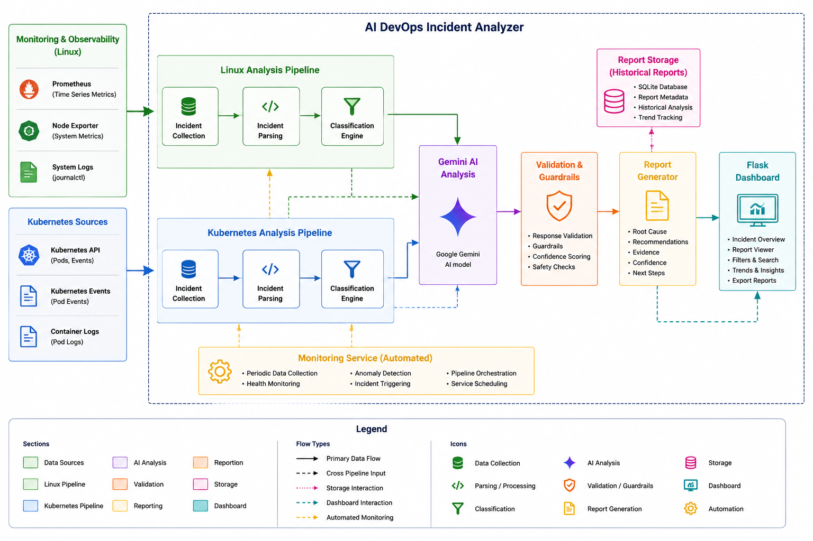

# AI DevOps Incident Analyzer

AI DevOps Incident Analyzer is a Python-based platform that automates incident investigation for Linux systems and Kubernetes clusters using AI-assisted root cause analysis.

The platform collects operational evidence, classifies incidents, generates AI-powered analysis using Google Gemini, validates responses, and presents results through a web dashboard.

---

## Features

### Linux Incident Analysis

- CPU Saturation Detection
- Memory Pressure Detection
- Load Analysis
- Disk I/O Pressure Analysis
- AI-generated Root Cause Analysis

### Kubernetes Incident Analysis

- OOMKilled Detection
- CrashLoopBackOff Detection
- ImagePullBackOff Detection
- Multi-Pod Cluster Analysis
- Kubernetes Evidence Collection

### AI Analysis

- Google Gemini Integration
- Root Cause Analysis
- Remediation Recommendations
- Investigation Guidance

### Reliability

- Response Validation
- AI Guardrails
- Confidence Scoring
- Historical Report Storage

### Dashboard

- Flask-based Web UI
- Incident Statistics
- Report History
- Linux and Kubernetes Incident Views

---

## Architecture



---

## Project Workflow

### Linux Workflow

```text
Metrics Collection
        ↓
Incident Detection
        ↓
Classification
        ↓
AI Analysis
        ↓
Validation
        ↓
Report Generation
        ↓
Dashboard
```

### Kubernetes Workflow

```text
Discover Failing Pods
         ↓
Collect Pod Evidence
         ↓
Parse Incident Data
         ↓
Classification
         ↓
AI Analysis
         ↓
Validation
         ↓
Report Generation
         ↓
Dashboard
```

---

## Technology Stack

- Python
- Flask
- Kubernetes
- Docker
- Google Gemini AI
- Linux
- Prometheus-style Metrics
- Git

---

## Incident Types Supported

### Linux

- CPU Saturation
- Memory Pressure
- High System Load

### Kubernetes

- OOMKilled
- CrashLoopBackOff
- ImagePullBackOff

---

## Screenshots

### Dashboard

(Add Dashboard Screenshot Here)

### Kubernetes Incident Report

(Add Kubernetes Report Screenshot Here)

### Linux Incident Report

(Add Linux Report Screenshot Here)

---

## Running the Project

### Install Dependencies

```bash
pip install -r requirements.txt
```

### Start Dashboard

```bash
python dashboard/app.py
```

Open:

```text
http://localhost:5000
```

### Analyze Linux

```bash
python analyzer/live_linux_ai_analyzer.py
```

### Analyze Kubernetes

```bash
python analyzer/live_k8s_ai_analyzer.py
```

---

## Future Improvements

- Grafana Alert Integration
- Prometheus Alertmanager Webhooks
- Slack Notifications
- Multi-Cluster Kubernetes Support
- Trend Analysis Dashboard
- AI Retry and Failover Logic

---

## Project Goals

This project was built to explore:

- Linux Internals
- Kubernetes Troubleshooting
- Incident Response Automation
- Observability Concepts
- AI-Assisted Operations
- SRE Workflows

while maintaining a strong focus on safe and explainable AI-assisted incident analysis.

