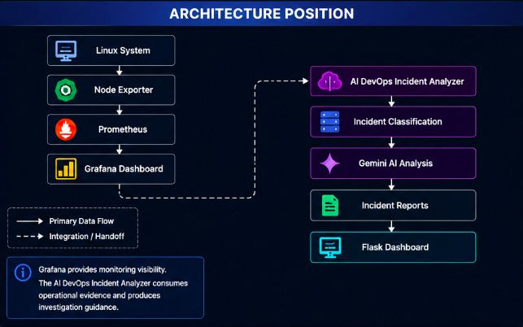

# Grafana Design Decisions

## Purpose

Grafana was introduced to provide visibility into node-level Linux metrics and to support understanding of system behavior before building AI-assisted incident analysis.

The dashboard serves as the observability layer of the project, while the AI DevOps Incident Analyzer provides incident investigation, classification, root-cause analysis, and report generation.

The objective is to answer:

> "What is happening on the system right now?"

while the AI analyzer answers:

> "Why might this be happening and what should be investigated next?"

---

## Dashboard Scope

The dashboard provides a high-level health view of a Linux node by visualizing:

* CPU availability
* Memory pressure
* Disk activity
* System load
* Monitoring availability

Its goal is situational awareness, not root-cause determination.

---

## Architecture Position

---

## Purpose of Each Panel

### Node Exporter Up

#### Why it exists

Confirms that monitoring itself is functioning.

#### What it tells me

* 1 = exporter reachable
* 0 = monitoring data unavailable

This indicates monitoring health, not necessarily system health.

---

### CPU Idle %

#### Why it exists

Shows how much CPU capacity remains available.

#### What it tells me

* High idle → CPU not saturated
* Low idle → possible CPU contention

Useful for identifying sustained CPU pressure.

---

### Memory Available

#### Why it exists

Represents memory that can be allocated immediately without swapping.

#### What it tells me

* Gradual decline → workload growth or cache usage
* Sharp decline → possible memory pressure

More useful than raw free memory.

---

### Disk I/O Time

#### Why it exists

Shows when storage devices are actively servicing I/O requests.

#### What it tells me

* High values → busy disk subsystem
* Low values → disk likely not a bottleneck

Does not directly indicate latency.

---

### Load Average (1m)

#### Why it exists

Represents overall system demand.

#### What it tells me

* Load near CPU count → busy but healthy
* Load significantly above CPU count → contention or blocking

Useful for identifying saturation.

---

## Dashboard Design Decisions

### Why These Panels Were Chosen

The selected panels represent independent resource domains:

* CPU
* Memory
* Disk
* Scheduling pressure

Together they provide a minimal but useful node health overview.

### Why Additional Panels Were Excluded

#### Per-process Metrics

Excluded to avoid excessive complexity during the learning phase.

#### Network Metrics

Not required for initial incident-analysis experiments.

#### Alerting

The focus was understanding system behavior before building automated alert workflows.

---

## Common Misinterpretations

### CPU Idle Is High, Therefore The System Is Healthy

Incorrect.

Processes may be blocked on:

* Disk I/O
* Locks
* External dependencies

CPU idle alone is insufficient.

---

### Memory Is Low, Therefore The System Is About To Crash

Incorrect.

Linux aggressively uses memory for caching.

Available memory and swap activity are more meaningful indicators.

---

### Disk I/O Time Is High, Therefore The Disk Is Slow

Incorrect.

The metric indicates disk activity, not latency.

Additional metrics are required to determine performance impact.

---

### Load Average Is Low, Therefore Everything Is Fine

Incorrect.

A critical process may still be failing despite low load.

Load is only one signal.

---

## Dashboard Limitations

### Exact Root Cause

Grafana can indicate abnormal behavior but cannot explain why it occurred.

Further investigation requires:

* Logs
* Application metrics
* Incident analysis
* Human reasoning

---

### Business Impact

System metrics do not reveal:

* User-facing latency
* Revenue impact
* Service-level degradation

Application-level observability is required.

---

### Intent

Metrics cannot distinguish between:

* Expected workload
* Misconfiguration
* Runaway processes
* Operational mistakes

Human context remains essential.

---

### Short-Lived Events

Brief spikes may occur between scrape intervals and remain invisible.

Higher-resolution monitoring may be required.

---

## Relationship to AI Incident Analysis

Grafana identifies symptoms.

Examples:

* CPU saturation
* High load
* Memory pressure
* Disk activity

The AI DevOps Incident Analyzer attempts to:

* Classify incidents
* Correlate available evidence
* Identify likely root causes
* Recommend investigation paths
* Generate structured incident reports

The two systems complement each other rather than replace each other.

---

## Evolution of the Project

The project began as an observability learning exercise using:

* Linux metrics
* Node Exporter
* Prometheus
* Grafana

It evolved into a broader incident-analysis platform featuring:

* Linux incident classification
* Kubernetes incident classification
* AI-assisted root-cause analysis
* Response validation
* Safety guardrails
* Historical report storage
* Flask-based incident dashboard

Grafana remains the monitoring foundation, while the AI DevOps Incident Analyzer provides investigation and reasoning capabilities.

---

## Summary

Grafana provides visibility into system behavior and resource utilization.

The AI DevOps Incident Analyzer builds on top of this observability foundation by transforming operational signals into structured incident investigations and AI-assisted root-cause analysis.

Together they form a practical workflow for learning observability, troubleshooting, and SRE-style incident response.

